<!-- ===== HEADER BANNER (custom animated SVG) ===== -->
<p align="center">
  
</p>

<!-- ===== TYPING ANIMATION ===== -->
<p align="center">
  <a href="https://github.com/Rajib-Mahmud">
    
  </a>
</p>

<p align="center">
  
</p>

<p align="center">
  <a href="https://hackerone.com/rajib_mahmud"></a>
  <a href="https://app.intigriti.com/researcher/profile/rajib_mahmud"></a>
  <a href="mailto:rakibwww6@gmail.com"></a>
</p>

<br>

<!-- ===== ABOUT ===== -->
```typescript
const rajib = {
  role: "Independent Security Researcher",
  base: "Dhaka, Bangladesh 🇧🇩",
  focus: ["web app security", "source code auditing", "vuln research"],
  reads: ["PHP", "TypeScript", "Python", "Solidity"],
  stack: ["Burp Suite", "custom recon tooling", "a lot of coffee"],
  philosophy: "quality over volume — no report without a working PoC",
};
```

<br>

<!-- ===== TOOLING ===== -->
### `~/` tooling

<table>
  <tr>
    <td width="50%" valign="top">
      <h4>🛰️ <a href="https://github.com/Rajib-Mahmud/surfmap">surfmap</a></h4>
      Attack surface intelligence — subdomains, URLs, API schema & parameter discovery, JS analysis, Telegram notify.
    </td>
    <td width="50%" valign="top">
      <h4>🐾 bountyhound</h4>
      Multi-platform bug bounty program discovery with real-time Telegram alerts.
    </td>
  </tr>
  <tr>
    <td width="50%" valign="top">
      <h4>⛏️ quarry</h4>
      Python CLI orchestrator for recon pipelines with SQLite dedup.
    </td>
    <td width="50%" valign="top">
      <h4>✍️ <a href="https://rajib-mahmud.github.io/intigriti-0726/">write-ups</a></h4>
      CTF & research write-ups — Intigriti monthly challenges and more.
    </td>
  </tr>
</table>

<br>

<!-- ===== STACK ===== -->
### `~/` stack

<p>
  
  
  
  
  
  
  
  
</p>

<br>

<!-- ===== STATS ===== -->
### `~/` stats

<p align="center">
  
  
</p>

<p align="center">
  
</p>

<!-- ===== FOOTER ===== -->


<p align="center"><i>All research conducted under responsible disclosure · authorized testing only.</i></p>
